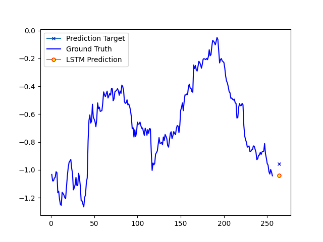

# stockLSTM
A small, experimental LSTM for predicting stock prices.
Author: Jacob Dawson

Requirements:
1. Tensorflow (best performance requires GPU speedup!)
2. Numpy
3. Sklearn
4. Matplotlib
5. Python (I hope that's obvious)
6. robin_stocks, an API for accessing RobinHood's historical data. Requires RobinHood sign-in credentials!

Files:
1. datasetMaker.py, which creates a file called "dataset.json" with data about stocks
2. smallLSTM.py, which initializes and trains a neural network. It also saves the weights and network to this folder.
3. make_sequence_prediction.py and make_single_prediction.py, which both load the pretrained network and use matplotlib to show some graphs about their predictions.
4. simpleEvaluation.py, which will simply import the whole dataset and report the some metrics about the model's abilities on it.
